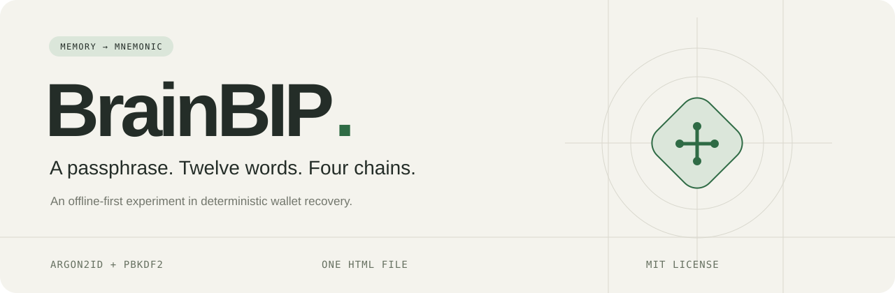

<p align="center">
  <a href="#try-it-locally">Try it locally</a> ·
  <a href="docs/derivation.md">Derivation specification</a> ·
  <a href="#security-model">Security model</a> ·
  <a href="LICENSE">MIT license</a>
</p>

BrainBIP turns a **passphrase + optional email salt** into a twelve-word BIP39 recovery phrase and the first twenty receiving addresses for Bitcoin, Ethereum, Solana, and Zcash.

Everything runs on your device. The build produces a complete HTML file with the interface, dictionaries, cryptographic code, and WebAssembly embedded. Open it in a browser, even without an internet connection.

> **Experimental, unaudited software.** A memory-hard function makes guessing more expensive; it cannot give a predictable passphrase the security of randomly generated recovery words. The hosted demo and release downloads are not published yet.

## A small, complete tool

- **Reproducible:** the same normalized inputs and `brainbip-v1` profile produce the same wallet.
- **Two derivation branches:** Argon2id and PBKDF2-SHA256, combined before creating the recovery phrase.
- **Twelve words:** numbered cards with reveal, hide, and explicit copy controls.
- **Eighty addresses:** twenty per chain, with the exact derivation path beside each address.
- **Local guesswork estimates:** dictionary-aware feedback, including a clearly conditional private-email estimate.
- **An offline edition:** one HTML file, no server, CDN, RPC, analytics, or runtime downloads.

## Try it locally

Requires Node.js 24 or later to build. The generated app only needs a modern browser with WebAssembly and Web Workers, and enough memory for a 256 MiB derivation plus browser overhead.

```sh
npm ci
npm run check
npm run dev
```

The preview is served at `http://127.0.0.1:4173`. Alternatively, open `dist/brainbip.html` directly in your browser. That file is the entire offline edition; it is byte-identical to the hosted `dist/index.html`.

1. Enter a passphrase and, optionally, an email salt.
2. Select **Generate recovery phrase**. Computation runs in a worker, with cancellation available.
3. Reveal the twelve words and browse each chain’s receiving addresses.
4. Select **Clear & reset** to discard the app’s inputs and results. This does not clear your system clipboard.

The generated `dist/` directory is ready for static hosting, including GitHub Pages. All app resources are embedded, so it works under a repository subpath. `SHA256SUMS.txt` records the HTML checksums; third-party notices are included both in the HTML and as a separate file.

## Recovery and compatibility

The custom input-to-mnemonic scheme is specific to BrainBIP. The resulting mnemonic follows BIP39, using the English wordlist and an **empty additional BIP39 passphrase**. Your original BrainBIP passphrase is not the additional passphrase requested by other BIP39 wallets.

| Chain | Mainnet address type | Derivation path, `i = 0…19` |
| --- | --- | --- |
| Bitcoin | Native SegWit P2WPKH, `bc1q…` | `m/84'/0'/0'/0/i` |
| Ethereum | EIP-55 checksummed | `m/44'/60'/0'/0/i` |
| Solana | Ed25519, Base58 | `m/44'/501'/i'/0'` |
| Zcash | Transparent P2PKH, `t1…` | `m/44'/133'/0'/0/i` |

Wallet import support and address discovery vary. A matching mnemonic alone does not ensure another wallet displays these paths. Zcash shielded and Unified Addresses are outside this version’s scope. BrainBIP displays addresses; it does not query balances or sign transactions.

The [derivation specification](docs/derivation.md) defines normalization, salt encoding, fixed parameters, and public test vectors. Keep the derivation version available for recovery. Settings are never reduced automatically on slower devices.

## Security model

An attacker can check guesses offline. There is no login server, rate limit, password reset, or recovery service. Anyone who reproduces the inputs can reproduce the wallet. Twelve output words have a 128-bit entropy capacity, but the strength of user-chosen inputs can be much lower. These chains’ ordinary signing keys are not post-quantum secure.

An email is treated as a **public salt by default** and adds zero estimated secret strength. The optional private-email model assumes its name is unknown and independent of the passphrase; the app cannot verify that assumption. The estimate excludes domain, letter case, and `+tags`, checks obvious overlap, and caps the conditional credit at 32 estimate bits. Neither the cap nor the displayed score is a calibrated security guarantee. English dictionaries provide limited coverage for other languages and personal references.

The app does not write inputs to browser storage or send them over the network. Editing an input invalidates prior results. Reset terminates workers and clears the app’s references and visible data; JavaScript and browser memory cannot offer a complete erasure guarantee. Clipboard contents, browser extensions, and a compromised device remain outside the app’s control. For sensitive experiments, inspect and verify the offline build before entering inputs.

## Development

```sh
npm test             # Cryptographic vectors, normalization, and strength estimates
npm run build        # Generate both standalone HTML editions and notices
npm run test:build   # Verify checksums, CSP hashes, and offline packaging
npm run test:browser # Exercise the UI and offline file in Chrome
```

Browser tests use a locally installed Google Chrome; CI installs Playwright Chromium. Dependencies are pinned in `package-lock.json` and bundled at build time. Test fixtures contain deliberately public example secrets and must never receive funds.

The Pages workflow checks the cryptographic vectors, standalone packaging, and browser behavior before publishing `dist/`. It runs when app, test, or build files change on `main`, and can also be started manually. Repository owners must select **GitHub Actions** as the publishing source in **Settings → Pages** before the first deployment.

The interface uses vanilla JavaScript and CSS. Cryptographic primitives come from [hash-wasm](https://github.com/Daninet/hash-wasm), [noble](https://github.com/paulmillr/noble-hashes), [scure](https://github.com/paulmillr/scure-bip39), and [micro-key-producer](https://github.com/paulmillr/micro-key-producer). Local password estimates use [zxcvbn-ts](https://github.com/zxcvbn-ts/zxcvbn). Inspired by [WarpWallet](https://github.com/keybase/warpwallet).

## License

BrainBIP code is [MIT licensed](LICENSE). Bundled third-party code and data retain their own licenses and attribution, including the English frequency data’s [ODC-BY license](https://opendatacommons.org/licenses/by/1-0/). Dependency audit history does not constitute an audit of BrainBIP or its custom composition.
